[回到知識庫總索引](https://released.github.io/)

<a id="article_top"></a>

# Nuvoton M2A23 – UART ISP code custom flow

> 說明 boot code 與 application 都位於 APROM 時的 UART IAP 架構，包含 Flash 分區、啟動判斷、映像檔產生、checksum 與 ICP / ISP 工具操作。

## 閱讀重點

- 先確認 boot region 與 application region 的起始位址、大小與 vector 配置。
- 再沿著 boot decision、image transfer、erase、program、verify 與 reset 流程閱讀。
- 修改 scatter file 或 SRecord 設定後，務必以輸出檔、map file 與實際燒錄結果交叉驗證。

## Reference Project

This training material is based on the **below reference project**:

- [M2A23BSP_IAP_UART_APROM](https://github.com/released/M2A23BSP_IAP_UART_APROM)


## Agenda

* System overview Flash layout + dual UART
* Boot code place in APROM flow — **custom ISP flow**
* Application code flow
* Build & image generation
* Tool settings ICP / ISP
* Runtime notes & pitfalls

---

<a id="article_overview"></a>

## 1. System overview

### Flash allocation actual project


> **Important !!!** 
> **Address is configurable**  
> - `APROM App code` start / size  
> - `APROM Boot code` base address example: `0x3000`  
>
> These addresses are **project-dependent** and **NOT fixed by hardware** , **adjust them** according to:
> - actual project application code size requirement
> - actual project boot code feature size
>
> The values used in this project `0x3000`, `0x1FFFC`are **one validated reference only**.


| Region | Address | Size | Purpose |
|------|--------|------|--------|
| APROM Application | `0x0000_3000 ~ 0x0001_FFFF` | `0x1D000` | app code |
| APROM checksum | `0x0001_FFFC` | 4 bytes |app code checksum address (CRC32) |
| Boot code in APROM | `0x0000_0000 ~ 0x0000_3000` | 12 KB | boot code |

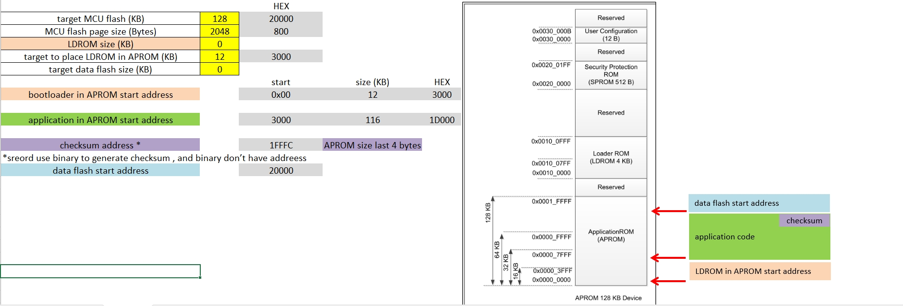

### UART assignment hard separation

| UART | Function | Used in |
|----|----|----|
| UART0 PB12/PB13 | ISP protocol | Boot only , to upgrade app code|
| UART1 PA8/PA9 | printf / progress log | Boot + App |

---

<a id="article_boot_flow"></a>

## 2. Boot code flow (place in start of APROM)

### Source-level structure important

```
main.c
 └─ main
    ├─ SYS_Init
    ├─ ISP_Init
    ├─ ISP_check_app
    └─ while1
        └─ ISP_process

isp_config.c   ← ★ Custom ISP state & policy
isp_user.c     ← UART RX / CMD handler
```

### Boot code flow

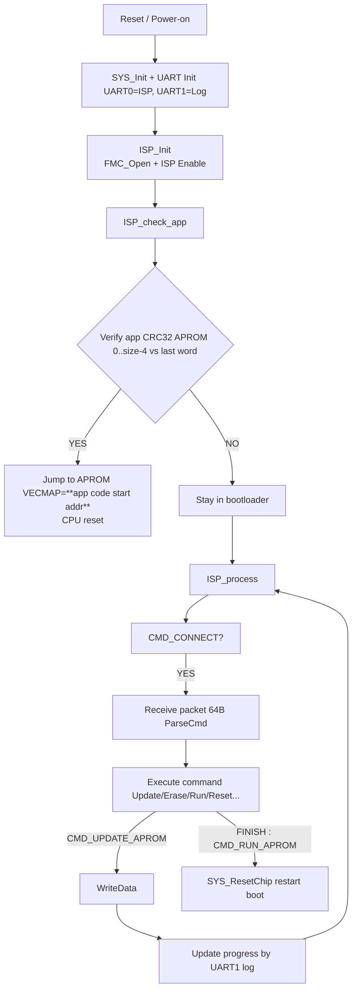

 1. Verify app CRC32 APROM (FAIL)
 2. Verify app CRC32 APROM (OK) 
 3. successful entry app code

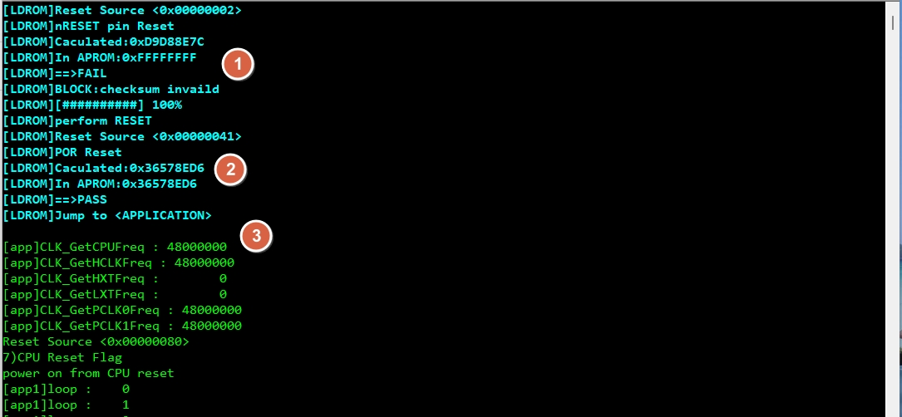


### Key point training emphasis

* **Protocol parsing and policy are separated**
  * `isp_user.c` → packet handling
  * `isp_config.c` → CRC check / boot decision / ISP behavior
* UART logging is **post-action only**, never **execute printf** during RX parsing

---

<a id="article_app_flow"></a>

## 3. Application code flow

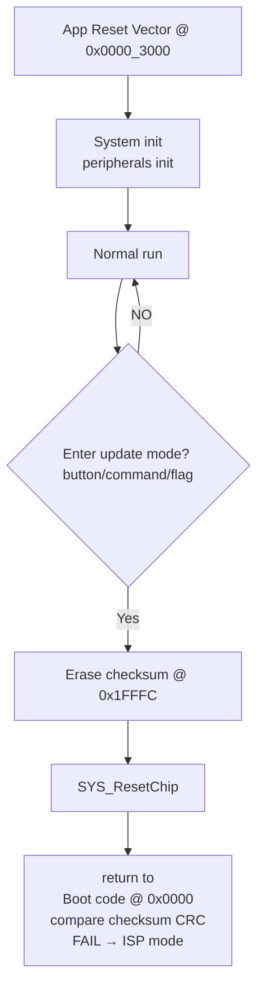

### Practical triggers from reference

* Press **'1'** by terminal → erase checksum (under app code)

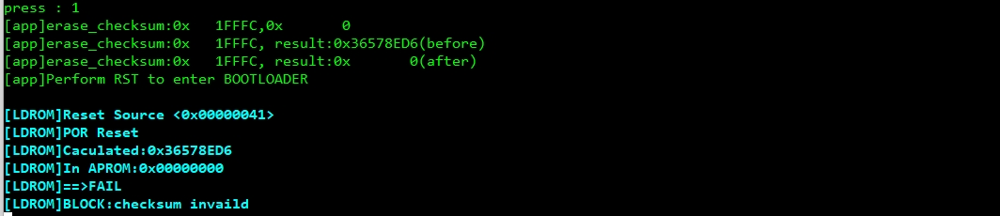


* Press **'Z' / 'z'** by terminal → reset to boot code (under app code)


* Press **nRESET** PIN on EVM (boot from boot code to app code)


---

<a id="article_build"></a>


### Scatter file in Boot code

Boot code project **uses a single scatter file**: `uart_iap.sct`.

- **Modify the address/size macros** if project memory layout changes

The linker layout for:
- boot code in APROM @ 0x0000

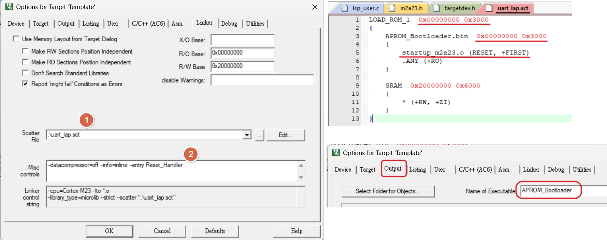

### Scatter file in App code

App code project **uses a single scatter file**: `APROM_application.sct`.

- **Modify the address/size macros** if project memory layout changes

The linker layout for:
- boot code in APROM @ 0x3000

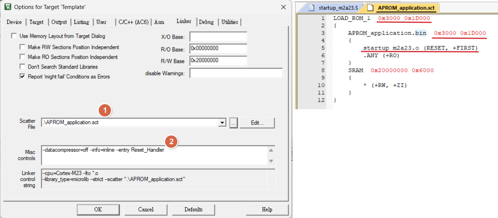

## 4. Build & image generation

### Keil targets recommended

| Target | Output |
|-----|------|
| APROM_BOOT | `APROM_Bootloader.bin` @ `0x0000` |

### Scatter file for boot code (uart_iap.sct)

```c
LOAD_ROM_1  0x00000000 0x3000
{
	APROM_Bootloader.bin  0x00000000 0x3000
	{
		startup_m2a23.o (RESET, +FIRST)
        .ANY (+RO)
	}
	
	SRAM  0x20000000 0x6000
	{
		* (+RW, +ZI)
	}
}
```

| Target | Output |
|-----|------|
| APROM_APP | `APROM_application.bin` @ `0x3000` |

### Scatter file for boot code (APROM_application.sct)

```c
LOAD_ROM_1  0x3000 0x1D000
{
	APROM_application.bin  0x3000 0x1D000
	{
		startup_m2a23.o (RESET, +FIRST)
        .ANY (+RO)
	}
	SRAM  0x20000000 0x6000
	{
		* (+RW, +ZI)
	}
}
```

### Checksum strategy actual project

* CRC32 over: `0x0000_3000 ~ 0x0001_FFFB`
* Stored at: `0x0001_FFFC`
* Boot compares SW CRC32 vs stored value

---

<a id="article_tools"></a>

## 5. Tool settings

### ICP tool mandatory (programming boot code)

* Program:
  * `APROM_Bootloader.bin` → APROM @ `0x0000`

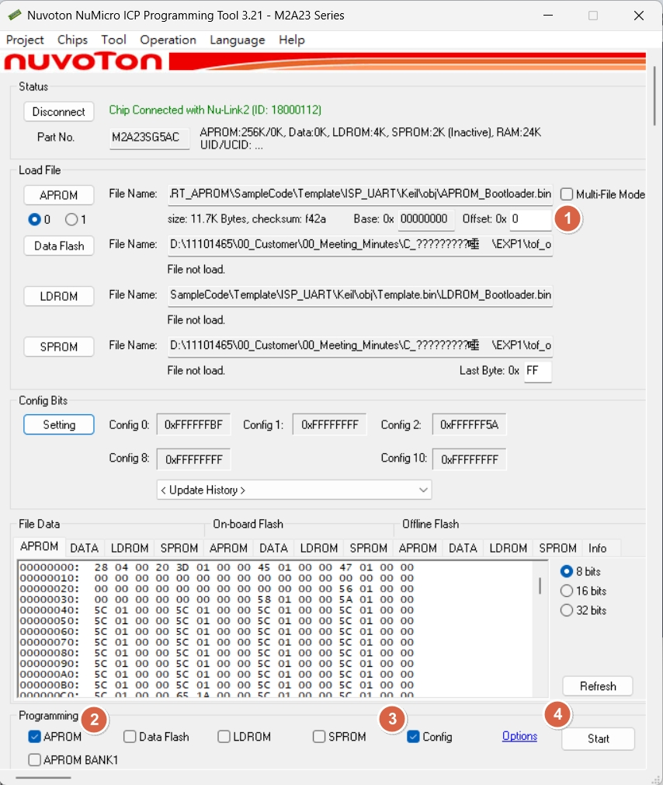

* CONFIG:
  * **Boot from APROM WITH IAP**

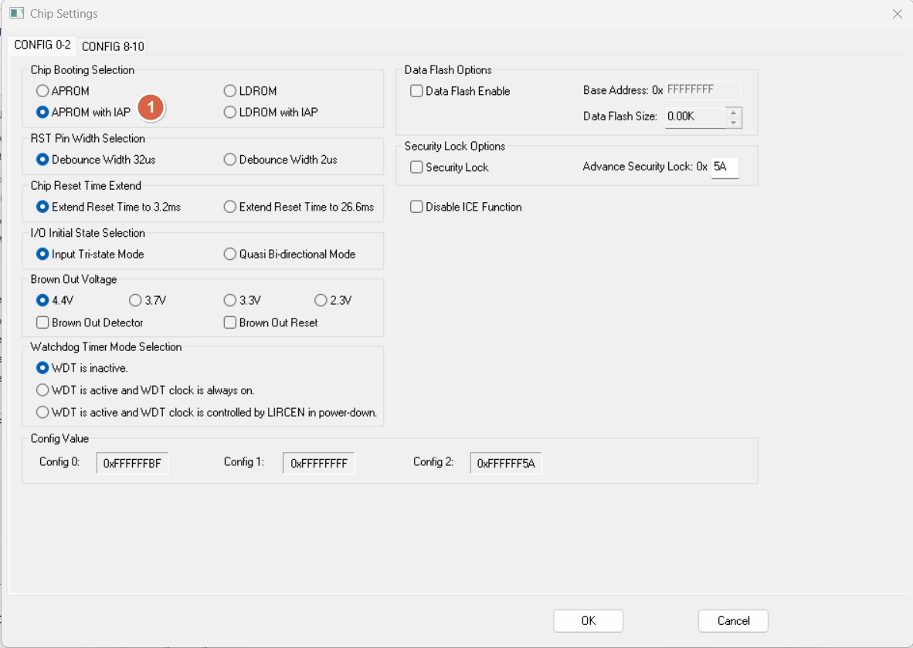

### ISP tool settings (programming app code)

* Connect ISP UART UART0 (target PCB) to PC USB-to-UART (UART bride)
* Open ISP tool (SW)

1. Select UART port & baud rate
2. Click “Connect” ( if MCU under boot mode , will stay with connected)
3. Load image:
   * APROM: load `APROM_application.bin`
4. Select `APROM`
5. Select `Reset and Run`
6. execute Program `Start`

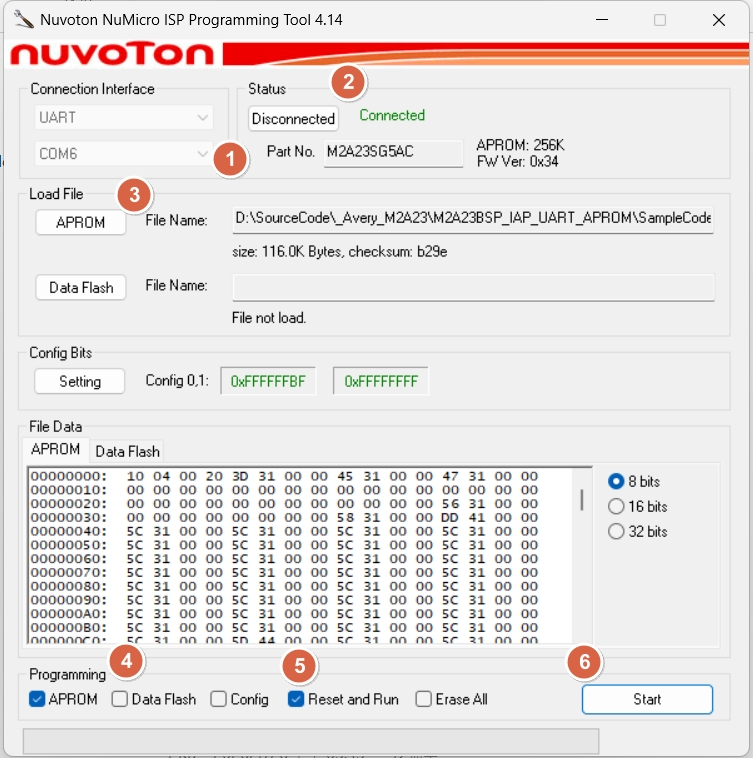

7. under ISP code tool , during upgrade application code

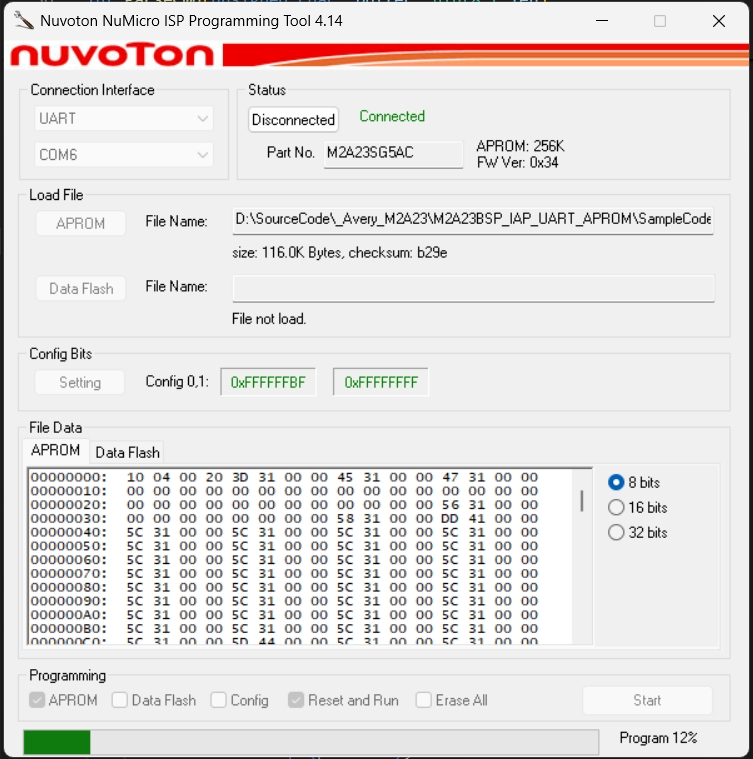

8. under boot code , during upgrade application code

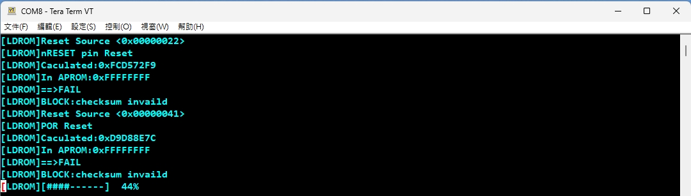


## Notes

* Bootloader may have a timeout window; connect sequence matters.
* After update, ensure CRC word is correct; otherwise boot will stay in ISP.


---

<a id="article_log"></a>

## 6. UART log & progress bar

```c

#define LDROM_DEBUG(format, args...) 		printf("\033[1;36m" "[LDROM]" format "\033[0m", ##args)

```

Progress bar width=10:

```
[LDROM] [#####-----] 50%
```

* Printed **after WriteData only**

---

<a id="article_summary"></a>

## 7. Summary training takeaway

* Boot is **policy-driven** `isp_config.c`
* Application controls update entry by **checksum invalidation**

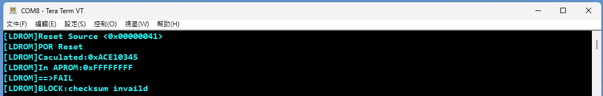

* Dual UART avoids ISP/log interference
* CRC32 is the single source of truth for boot decision

---

# Appendix: Extended Build / Tool Details

<a id="appendix_top"></a>

# Agenda

* Boot code in boot code ,app code image generation
* SRecord post-build merge + CRC32

---

<a id="article_split_binary"></a>

# Boot code: place @ start of APROM 0x0000

## layout default

* `APPROM`: `0x0000_0000` ~ `0x0000_3000`  0x3000 bytes

## output artifacts

* `APROM_Bootloader.bin` boot code stage, linked at APROM@0x0000

```c
refer to uart_iap.sct
```

---

# App code: place @ APROM 0x3000

## layout default

* `APPROM`: `0x0000_3000` ~ `0x0002_0000`  0x1D000 bytes

## output artifacts

* `APROM_application.bin` app code linked at 0x0000_3000, size ≤ 0x1D000, includes CRC word

```c
refer to APROM_application.sct
```

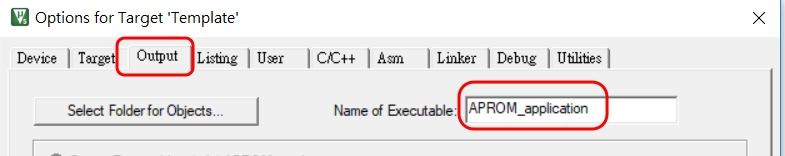


[back to top](#article_top)

---

<a id="article_srecord"></a>

# SRecord settings merge + CRC32 append

## Use cases

* Fill holes with 0xFF
* KEIL setting : after compile , generate checksum with by batch file
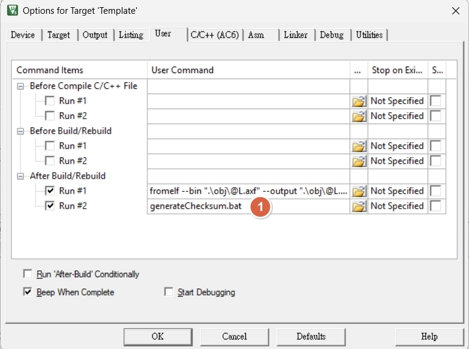
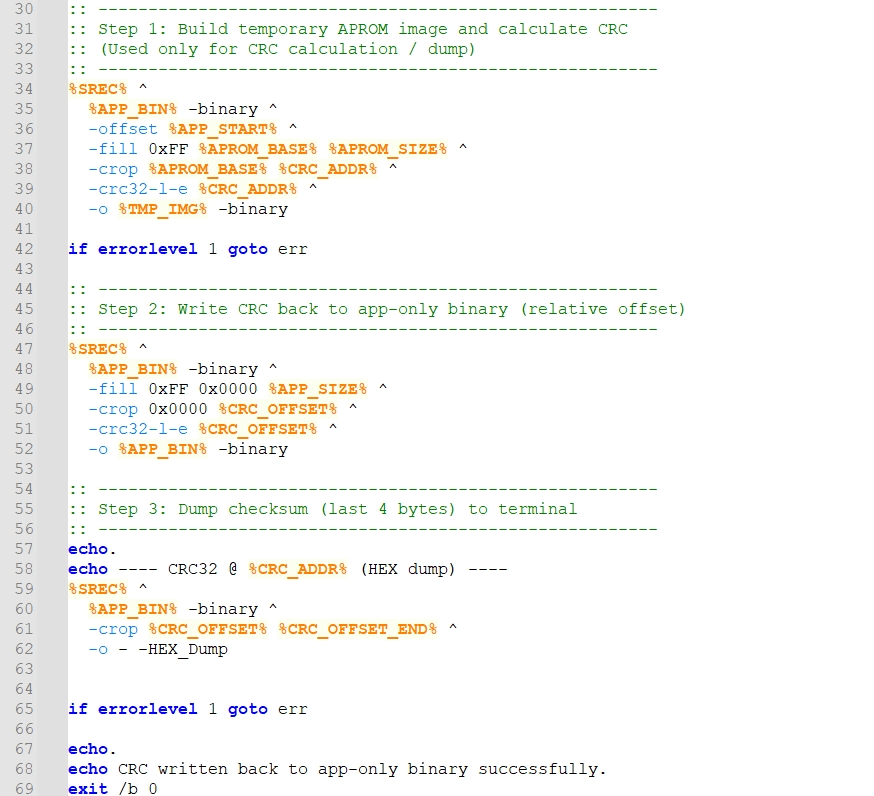

**generateChecksum.bat**

```c
@echo off
setlocal

call checksum_config.cmd

set SREC=srec_cat

set APP_BIN=obj\APROM_application.bin
set TMP_IMG=obj\_aprom_crc_tmp.bin

echo ========================================================
echo Generate CRC32 (ABSOLUTE address semantics)
echo --------------------------------------------------------
echo APP_START  = %APP_START%
echo APP_SIZE   = %APP_SIZE%
echo CRC_ADDR   = %CRC_ADDR%
echo APP_BIN    = %APP_BIN%
echo ========================================================

:: =========================================================
:: Derived values (DO NOT EDIT)
:: =========================================================

:: Relative offset inside app-only binary
set CRC_SIZE=4
set /a CRC_OFFSET=CRC_ADDR - APP_START
set /a CRC_END=CRC_ADDR + CRC_SIZE
set /a CRC_OFFSET_END=CRC_OFFSET + CRC_SIZE

:: --------------------------------------------------------
:: Step 1: Build temporary APROM image and calculate CRC
:: (Used only for CRC calculation / dump)
:: --------------------------------------------------------
%SREC% ^
  %APP_BIN% -binary ^
  -offset %APP_START% ^
  -fill 0xFF %APROM_BASE% %APROM_SIZE% ^
  -crop %APROM_BASE% %CRC_ADDR% ^
  -crc32-l-e %CRC_ADDR% ^
  -o %TMP_IMG% -binary

if errorlevel 1 goto err

:: --------------------------------------------------------
:: Step 2: Write CRC back to app-only binary (relative offset)
:: --------------------------------------------------------
%SREC% ^
  %APP_BIN% -binary ^
  -fill 0xFF 0x0000 %APP_SIZE% ^
  -crop 0x0000 %CRC_OFFSET% ^
  -crc32-l-e %CRC_OFFSET% ^
  -o %APP_BIN% -binary

:: --------------------------------------------------------
:: Step 3: Dump checksum (last 4 bytes) to terminal
:: --------------------------------------------------------
echo.
echo ---- CRC32 @ %CRC_ADDR% (HEX dump) ----
%SREC% ^
  %APP_BIN% -binary ^
  -crop %CRC_OFFSET% %CRC_OFFSET_END% ^
  -o - -HEX_Dump


if errorlevel 1 goto err

echo.
echo CRC written back to app-only binary successfully.
exit /b 0

:err
echo CRC generation FAILED
exit /b 1


```

**checksum_config.cmd** ==(the only file need to modify)==
```c
@echo off
:: =========================================================
:: Flash absolute layout (DESIGN INTENT)
:: =========================================================

set APROM_BASE=0x0000
set APROM_SIZE=0x20000

set APP_START=0x3000
set APP_SIZE=0x1D000

:: CRC is always at the last 4 bytes of APROM
set CRC_ADDR=0x1FFFC

```


[back to top](#article_top)

---
